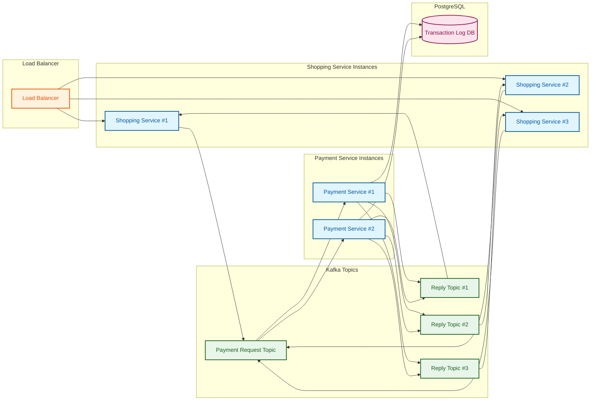

# Shopping Application

A modern shopping application built with Spring Boot, featuring asynchronous processing, Kafka integration, and multiple controller implementations.

## System Architecture

### V3 Endpoint Architecture (Kafka-based Service-to-Service Communication)



### Architecture Components

1. **Load Balancer**
   - Distributes incoming requests across multiple Shopping Service instances
   - Ensures high availability and load distribution

2. **Shopping Service Instances**
   - Horizontally scalable instances of the shopping service
   - Each instance has its own dedicated reply topic
   - Processes order requests and handles payment responses

3. **Kafka Topics**
   - **Payment Request Topic**: Handles payment processing requests
   - **Reply Topics**: Dedicated topics for each shopping service instance to receive responses

4. **Payment Service Instances**
   - Horizontally scalable payment processing services
   - Consumes from Payment Request Topic
   - Publishes to Reply Topics
   - Writes transaction logs to PostgreSQL

5. **PostgreSQL Database**
   - Stores transaction logs
   - Maintains payment history and state
   - Ensures data persistence and consistency

### Flow Description

1. Client request arrives at Load Balancer
2. Request is routed to one of the Shopping Service instances
3. Shopping Service publishes order request to Payment Request Topic
4. Payment Service instances consume from Payment Request Topic
5. Payment Service processes the request and:
   - Writes transaction log to PostgreSQL
   - Publishes response to Reply Topics
6. Shopping Service instance receives response on its dedicated Reply Topic
7. Response is sent back to the client

This architecture provides:
- Horizontal scalability at all layers
- Fault tolerance through multiple instances
- Asynchronous processing
- Reliable message delivery
- Transaction logging and persistence
- Clear separation of concerns

## Project Structure

The project follows a standard Spring Boot architecture with the following main components:

### Models
- `Product.java`: Represents a product in the shopping system
- `OrderRequest.java`: Request model for creating orders
- `OrderResponse.java`: Response model for order operations
- `PaymentRequest.java`: Request model for payment processing
- `PaymentResponse.java`: Response model for payment operations

### Controllers
- `OrderControllerBlocking.java`: Traditional blocking controller implementation
- `OrderControllerBlockingVT.java`: Blocking controller with virtual threads
- `OrderControllerAsync.java`: Asynchronous controller implementation

### Services
- `PaymentService.java`: Core payment processing service
- `KafkaPaymentService.java`: Kafka-based payment processing implementation

### Configuration
- `KafkaConfig.java`: Kafka configuration and setup
- `Http3NettyWebServerCustomizer.java`: HTTP/3 server configuration
- `ShoppingConfiguration.java`: Main application configuration
- `ShoppingApplication.java`: Application entry point

## Features

- Multiple controller implementations for different processing models:
  - Traditional blocking
  - Virtual thread-based blocking
  - Asynchronous processing
- Kafka integration for payment processing
- HTTP/3 support
- Docker support for containerization

## Building and Running

### Prerequisites
- Java 17 or later
- Maven or Gradle
- Docker (optional)

### Using Maven
```bash
mvn clean install
mvn spring-boot:run
```

### Using Gradle
```bash
./gradlew build
./gradlew bootRun
```

### Docker
```bash
docker build -t shopping-app .
docker run -p 8080:8080 shopping-app
```

## API Endpoints

The application provides REST endpoints for:
- Order processing
- Payment handling
- Product management

## Configuration

The application can be configured through:
- `application.properties` or `application.yml`
- Environment variables
- Command line arguments

## Development

The project uses:
- Spring Boot for the application framework
- Kafka for message processing
- Netty for HTTP/3 support
- Maven/Gradle for build management

## License

[Add your license information here] 